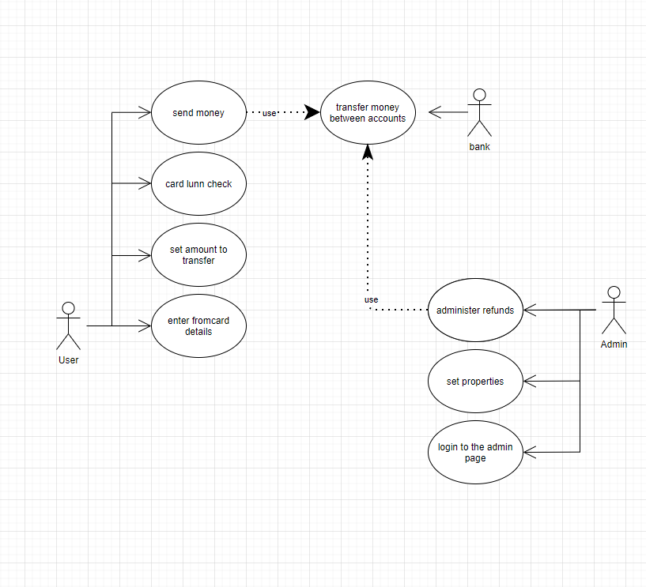
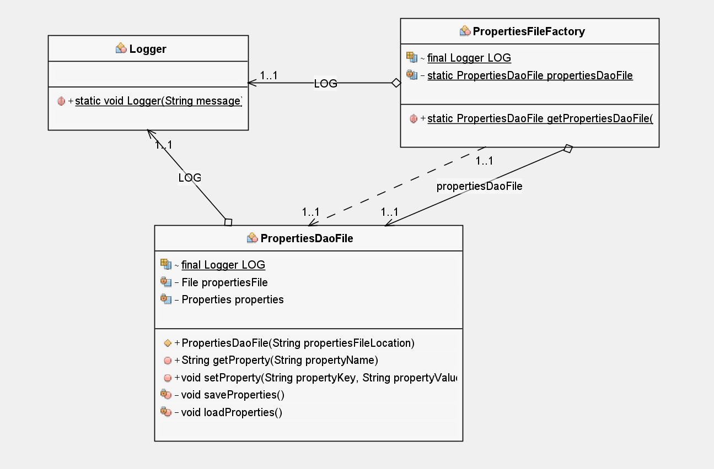
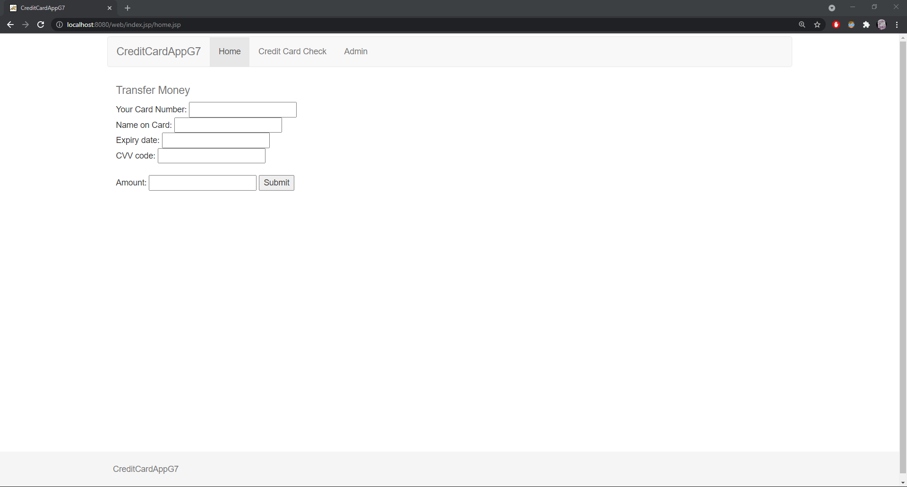
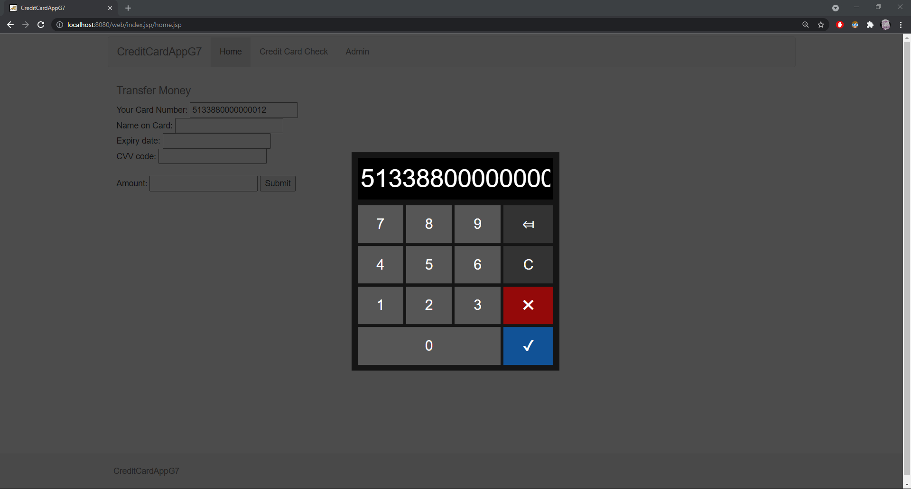
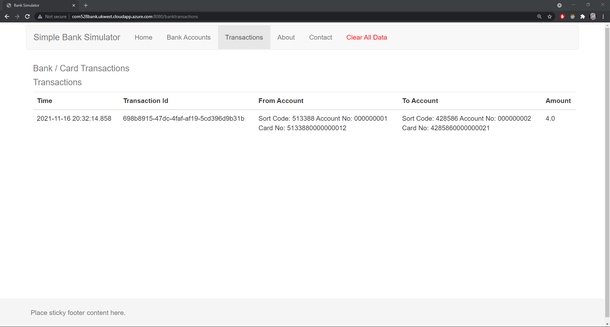
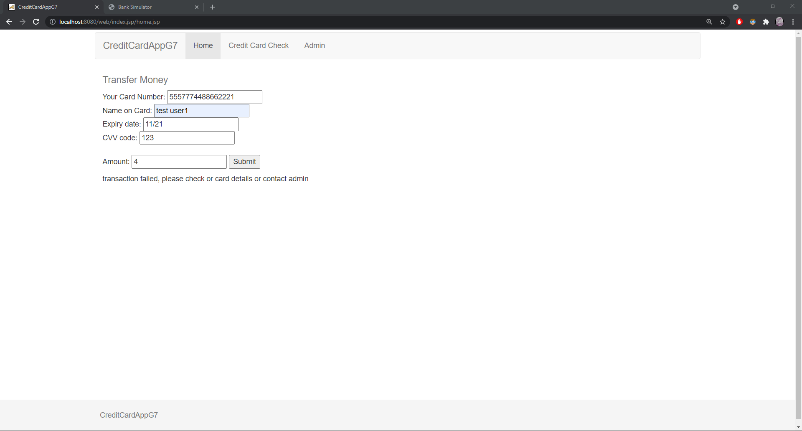
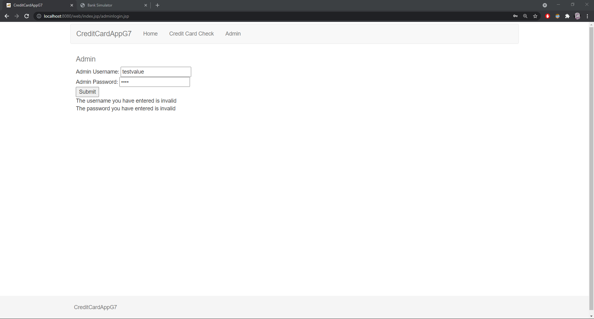
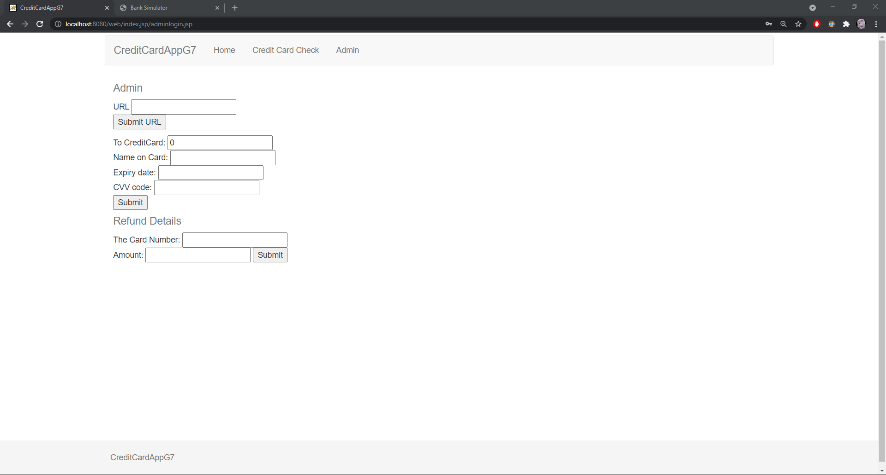
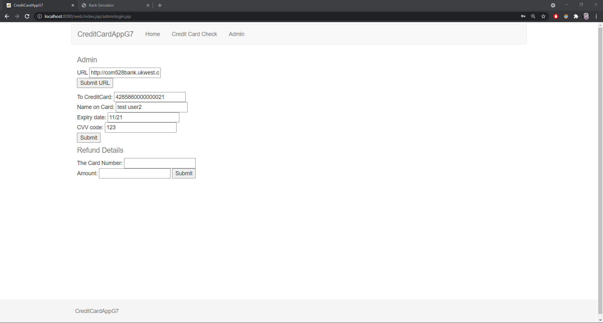
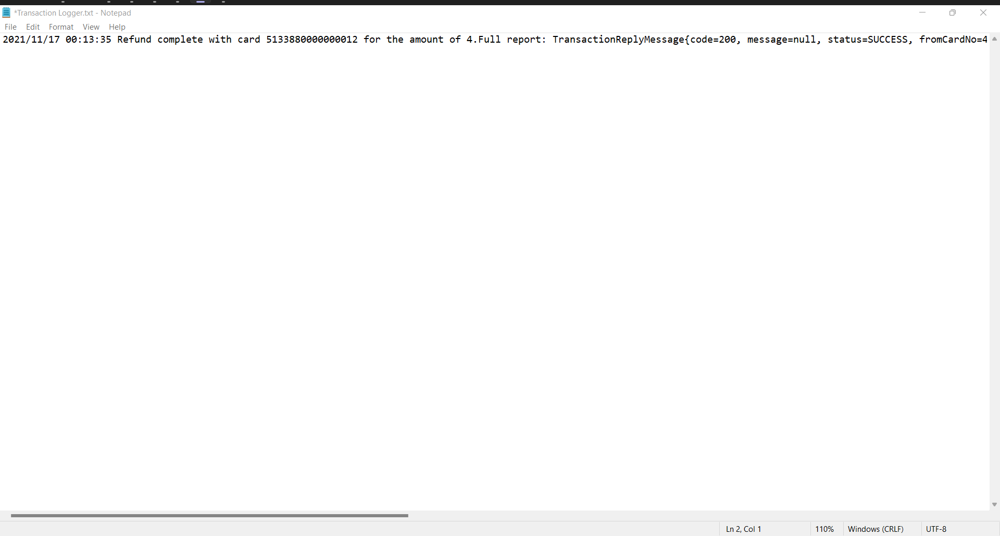

<h1>CreditCardAppG7 Documentation</h1>

<h2 style="text-decoration: underline">Introduction:</h2>

When creating this project, we decided to work on what we were strongest at. Sophia using html and javascript to do mostly front-end development with creating form fields, form sending, connecting to rest and bank API to make transactions, use case diagram, password protected admin page, customer and admin form validation and a “logged in” attribute. William applied bootstrap to the project, numpad, card checker, and documentation of javadocs and UML diagrams whilst also handling github management. Theodore did mostly back-end development working with properties, dependencies, logging transactions, exception and error handling, refund capabilities and creating tests. 

To help manage our project we used the project functionality within our shared github repo so that everyone could update how they were getting along with the project to the whole group <a href='https://github.com/william-hayward/oodd-assessment/projects/1'>(https://github.com/william-hayward/oodd-assessment/projects/1)</a>. Using this helped us visualise how far we were into this project and letting us know what features were yet to be implemented. 

<h2 style="text-decoration: underline">Use Case Diagram:</h2>

A simple use case diagram of the project:

---

<h2 style="text-decoration: underline">Javadoc:</h2>

To generate a Javadoc: Right click on the web module and click "generate Javadoc". This will save to an apidocs folder "\groupa7\web\target\site\apidocs\". The Javadoc can be viewed using a web browser (see image below).

---

<h2 style="text-decoration: underline">UML Diagram:</h2>

UML diagram for the Web module:

---

<h2 style="text-decoration: underline">Code Tests:</h2> 

<h2>Test 1:</h2>

|          Test           |                            Expected Result                             |                            Actual Result                             |          Valid or invalid           | Action needed |
| :---------------------: | :--------------------------------------------------------------------: | :------------------------------------------------------------------: | :---------------------------------: | :-----------: |
| Web pages and bootstrap | All web pages to load correctly with bootstrap working within them all | Every page loads as intended and bootstrap is used within every page | Valid  |     none      |

 

<h2>Test 2:</h2>

|  Test  |                                         Expected Result                                         |                         Actual Result                          |          Valid or invalid           | Action needed |
| :----: | :---------------------------------------------------------------------------------------------: | :------------------------------------------------------------: | :---------------------------------: | :-----------: |
| Numpad | When clicking on a form which requires a card number input, a numpad will show up on the screen | The numpad shows up and allows the user to input their details | Valid  |     none      |

 

<h2>Test 3:</h2>

|     Test     |                                       Expected Result                                        |             Actual Result              |          Valid or invalid           | Action needed |
| :----------: | :------------------------------------------------------------------------------------------: | :------------------------------------: | :---------------------------------: | :-----------: |
| Transactions | When having entered the correct card details, the program will transfer the specified amount | The program does complete the transfer | Valid  |     none      |

 

<h2>Test 4:</h2>

|         Test         |                                Expected Result                                 |         Actual Result          |          Valid or invalid           | Action needed |
| :------------------: | :----------------------------------------------------------------------------: | :----------------------------: | :---------------------------------: | :-----------: |
| Invalid Transactions | When having entered the wrong card details, the program shows an error message | The program does show an error | Valid  |     none      |

 

<h2>Test 5:</h2>

|            Test             |                                      Expected Result                                      |                          Actual Result                          |          Valid or invalid           | Action needed |
| :-------------------------: | :---------------------------------------------------------------------------------------: | :-------------------------------------------------------------: | :---------------------------------: | :-----------: |
| Invalid Admin login details | Adding an invalid username and password will not show the admin page. Error will be shown | An error was shown and the user was not taken to the admin page | Valid  |     none      |

 

<h2>Test 6:</h2>

|    Test     |                                       Expected Result                                       |                      Actual Result                      |          Valid or invalid           | Action needed |
| :---------: | :-----------------------------------------------------------------------------------------: | :-----------------------------------------------------: | :---------------------------------: | :-----------: |
| Admin Login | When entering the correct admin username and password, the admin capabilities will be shown | Entering the correct details revealed the admin section | Valid  |     none      |

 

<h2>Test 7:</h2>

|             Test              |                                                      Expected Result                                                      |                       Actual Result                        |          Valid or invalid           | Action needed |
| :---------------------------: | :-----------------------------------------------------------------------------------------------------------------------: | :--------------------------------------------------------: | :---------------------------------: | :-----------: |
| Properties for the admin page | once the admin has set the URL and toCard, the values will be saved in the properties file and used within the admin page | The properties are saved and still show after a page reset | Valid  |     none      |

 

<h2>Test 8:</h2>

|  Test   |                                 Expected Result                                 |                           Actual Result                            |          Valid or invalid           | Action needed |
| :-----: | :-----------------------------------------------------------------------------: | :----------------------------------------------------------------: | :---------------------------------: | :-----------: |
| Refunds | When the admin enters the card details, they can administer refunds to accounts | Refund capabilities worked when the admin entered the correct card | Valid  |     none      |

 

<h2>Test 9:</h2>

|        Test         |                    Expected Result                     |                         Actual Result                          |          Valid or invalid           | Action needed |
| :-----------------: | :----------------------------------------------------: | :------------------------------------------------------------: | :---------------------------------: | :-----------: |
| Transaction logging | When a transaction happens, it is logged within tomcat | Logging was added to a "transaction logger" file within tomcat | Valid  |     none      |
